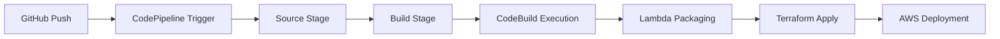

# DOFS CI/CD Pipeline Explanation

## Overview
The DOFS CI/CD pipeline provides automated deployment of Lambda functions and infrastructure changes using AWS CodePipeline, CodeBuild, and Terraform.

## Pipeline Architecture



## Pipeline Components

### 1. Source Stage (GitHub Integration)

**Trigger:** Git push to `main` branch
**Connection:** AWS CodeStar Connection to GitHub
**Repository:** `pratikgoswamii/dofs-project`

**Configuration:**
```hcl
# CodeStar Connection
resource "aws_codestarconnections_connection" "github_connection" {
  name          = "dofs-github-connection"
  provider_type = "GitHub"
}

# Pipeline Source Stage
stage {
  name = "Source"
  action {
    name             = "Source"
    category         = "Source"
    owner            = "AWS"
    provider         = "CodeStarSourceConnection"
    version          = "1"
    output_artifacts = ["source_output"]
    
    configuration = {
      ConnectionArn    = aws_codestarconnections_connection.github_connection.arn
      FullRepositoryId = "pratikgoswamii/dofs-project"
      BranchName       = "main"
      DetectChanges    = true
    }
  }
}
```

### 2. Build Stage (CodeBuild)

**Purpose:** Package Lambda functions and deploy infrastructure
**Environment:** `aws/codebuild/standard:7.0` (Linux container)
**Build Specification:** `buildspec.yml`

**Build Process:**
1. **Install Phase:** Install Terraform
2. **Pre-build Phase:** Package Lambda functions
3. **Build Phase:** Run Terraform deployment
4. **Post-build Phase:** Generate artifacts

## Build Specification (`buildspec.yml`)

```yaml
version: 0.2

phases:
  install:
    runtime-versions:
      python: 3.9
    commands:
      - echo "Installing Terraform..."
      - curl -o terraform.zip https://releases.hashicorp.com/terraform/1.8.0/terraform_1.8.0_linux_amd64.zip
      - unzip -o terraform.zip -d /tmp
      - mv /tmp/terraform /usr/local/bin/terraform
      - terraform version

  pre_build:
    commands:
      - echo "Creating Lambda deployment packages..."
      - |
        for dir in lambdas/*; do
          if [ -d "$dir" ]; then
            name=$(basename "$dir")
            zip_path="$dir/$name.zip"
            echo "Creating zip for $dir → $zip_path"
            rm -f "$zip_path"
            if [ -f "$dir/requirements.txt" ]; then
              echo "Installing dependencies for $name"
              pip install -r "$dir/requirements.txt" -t "$dir"
            fi
            (cd "$dir" && zip -r "$name.zip" . -x "*.zip")
            echo "Created: $zip_path"
          fi
        done

  build:
    commands:
      - echo "Running Terraform deployment..."
      - cd terraform
      - terraform init
      - terraform apply -auto-approve
      - cd ..

  post_build:
    commands:
      - echo "Build finished at `date`"
      - echo "Listing created Lambda packages:"
      - find lambdas -name "*.zip" -exec ls -la {} \;

artifacts:
  files:
    - '**/*.zip'
```

## Lambda Function Packaging

### Packaging Process
1. **Iterate through Lambda directories** (`lambdas/*/`)
2. **Install dependencies** if `requirements.txt` exists
3. **Create ZIP packages** in correct locations for Terraform
4. **Exclude existing ZIPs** to prevent nested packaging

### Package Locations
```
lambdas/
├── api_handler/
│   ├── api_handler.py
│   └── api_handler.zip      ← Created by CI/CD
├── validator/
│   ├── validator.py
│   └── validator.zip        ← Created by CI/CD
└── ...
```

## Terraform Integration

### Source Code Hash Detection
Each Lambda function includes `source_code_hash` for change detection:

```hcl
resource "aws_lambda_function" "api_handler" {
  filename         = "${path.module}/../../../lambdas/api_handler/api_handler.zip"
  source_code_hash = filebase64sha256("${path.module}/../../../lambdas/api_handler/api_handler.zip")
  # ... other configuration
}
```

### Deployment Process
1. **Terraform Init:** Initialize backend and providers
2. **Terraform Apply:** Deploy infrastructure changes
3. **Lambda Updates:** Detected via ZIP file hash changes
4. **Resource Updates:** Only changed resources are updated

## IAM Permissions

### CodePipeline Role
```json
{
  "Version": "2012-10-17",
  "Statement": [
    {
      "Effect": "Allow",
      "Action": "*",
      "Resource": "*"
    }
  ]
}
```

### CodeBuild Role
```json
{
  "Version": "2012-10-17",
  "Statement": [
    {
      "Effect": "Allow",
      "Action": "*",
      "Resource": "*"
    }
  ]
}
```

**Note:** Production environments should use least-privilege permissions.

## Pipeline Monitoring

### CloudWatch Logs
- **CodeBuild Logs:** `/aws/codebuild/dofs-build-dev`
- **Pipeline Events:** CloudWatch Events for pipeline state changes

### Monitoring Commands
```bash
# Check pipeline status
aws codepipeline list-pipeline-executions \
  --pipeline-name dofs-pipeline-dev \
  --region ap-south-1

# Get build details
aws codebuild batch-get-builds \
  --ids BUILD_ID \
  --region ap-south-1

# Monitor build logs
aws logs tail /aws/codebuild/dofs-build-dev --follow
```

## Pipeline Triggers

### Automatic Triggers
- **Git Push:** Any push to `main` branch
- **GitHub Webhooks:** Real-time trigger via CodeStar connection

### Manual Triggers
```bash
# Start pipeline manually
aws codepipeline start-pipeline-execution \
  --name dofs-pipeline-dev \
  --region ap-south-1
```

## Deployment Flow

### 1. Code Change Detection
```
Developer Push → GitHub → CodeStar Connection → CodePipeline
```

### 2. Build Execution
```
Source Download → Lambda Packaging → Terraform Deployment → AWS Updates
```

### 3. Verification
```
Lambda Function Updates → API Gateway Integration → End-to-End Testing
```

## Pipeline Performance

### Typical Execution Times
- **Source Stage:** 10-30 seconds
- **Build Stage:** 3-5 minutes
- **Total Pipeline:** 4-6 minutes

### Optimization Strategies
1. **Parallel Builds:** Not currently implemented
2. **Caching:** Terraform state caching
3. **Selective Deployment:** Only changed resources

## Error Handling

### Build Failures
- **Terraform Errors:** Check resource conflicts
- **Lambda Packaging:** Verify file permissions
- **IAM Issues:** Check role permissions

### Rollback Strategy
```bash
# Manual rollback via Terraform
cd terraform
terraform plan -destroy -target=resource.name
terraform apply -target=resource.name

# Or use previous pipeline execution
aws codepipeline get-pipeline-execution \
  --pipeline-name dofs-pipeline-dev \
  --pipeline-execution-id PREVIOUS_ID
```

## Security Considerations

### Secrets Management
- **No hardcoded credentials** in repository
- **IAM roles** for service authentication
- **Environment variables** for configuration

### Access Control
- **GitHub repository** access controls
- **AWS IAM** permissions for pipeline
- **CodeStar connection** authorization

## Best Practices

### 1. Code Quality
- **Linting:** Add code quality checks
- **Testing:** Implement unit tests
- **Security Scanning:** Add security validation

### 2. Deployment Safety
- **Staging Environment:** Test before production
- **Blue/Green Deployment:** Zero-downtime updates
- **Rollback Plan:** Quick recovery strategy

### 3. Monitoring
- **Pipeline Alerts:** Notify on failures
- **Performance Metrics:** Track deployment times
- **Cost Monitoring:** Track resource usage

## Future Enhancements

### Planned Improvements
1. **Multi-Environment Support** (dev/staging/prod)
2. **Automated Testing** integration
3. **Security Scanning** in pipeline
4. **Performance Monitoring** integration
5. **Cost Optimization** reporting

### Advanced Features
- **Parallel Builds** for faster deployment
- **Conditional Deployment** based on changes
- **Integration Testing** automation
- **Performance Benchmarking** in pipeline