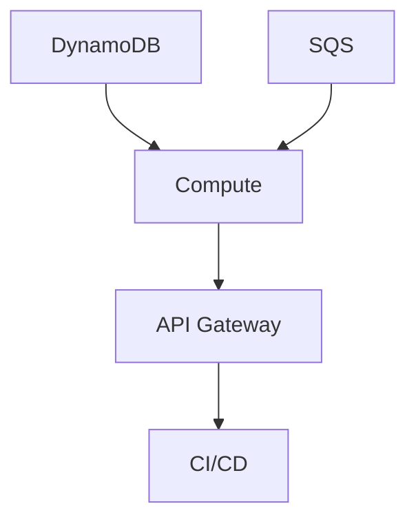

# DOFS Terraform Modules Documentation

## Overview
This directory contains well-documented, reusable Terraform modules for the DOFS (Distributed Order Fulfillment System) infrastructure.

## Module Structure

```
modules/
├── api_gateway/     # REST API configuration
├── compute/         # Lambda functions + Step Functions
├── dynamodb/        # Database tables
├── sqs/            # Message queues and DLQ
└── cicd/           # CI/CD pipeline
```

## Module Documentation

### 1. API Gateway Module (`api_gateway/`)

**Purpose:** Creates REST API endpoints for order processing

**Resources:**
- API Gateway REST API
- API Gateway Deployment
- API Gateway Stage
- Lambda permissions for API Gateway

**Inputs:**
- `project_name` - Project identifier
- `environment` - Environment (dev/staging/prod)
- `api_handler_lambda_invoke_arn` - Lambda function ARN
- `api_handler_lambda_function_name` - Lambda function name

**Outputs:**
- `api_gateway_url` - Base URL for API endpoints

**Usage:**
```hcl
module "api_gateway" {
  source = "./modules/api_gateway"
  
  project_name                     = "dofs"
  environment                      = "dev"
  api_handler_lambda_invoke_arn    = module.compute.api_handler_invoke_arn
  api_handler_lambda_function_name = module.compute.api_handler_function_name
}
```

### 2. Compute Module (`compute/`)

**Purpose:** Manages Lambda functions and Step Functions orchestration

**Resources:**
- 5 Lambda functions (API handler, validator, storage, fulfillment, DLQ processor)
- Step Functions state machine
- IAM roles and policies
- CloudWatch log groups
- SQS event source mappings

**Key Features:**
- Resolves circular dependencies between Lambda and Step Functions
- Includes `source_code_hash` for CI/CD compatibility
- Comprehensive error handling and retry logic

**Inputs:**
- `project_name`, `environment` - Basic configuration
- `orders_table_name`, `orders_table_arn` - DynamoDB integration
- `failed_orders_table_name`, `failed_orders_table_arn` - Failed orders storage
- `order_queue_url`, `order_queue_arn` - SQS integration
- `order_dlq_arn` - Dead letter queue

**Outputs:**
- Lambda function ARNs and names
- Step Function ARN

### 3. DynamoDB Module (`dynamodb/`)

**Purpose:** Creates database tables for order storage

**Resources:**
- Orders table (successful orders)
- Failed orders table (DLQ processed failures)

**Configuration:**
- Pay-per-request billing mode
- Server-side encryption enabled
- Point-in-time recovery enabled

**Schema:**
```
Orders Table:
- order_id (String, Hash Key)
- customer_id, items, total_amount, status, timestamps

Failed Orders Table:
- order_id (String, Hash Key)
- failure_reason, failed_at, original_order_data
```

### 4. SQS Module (`sqs/`)

**Purpose:** Message queuing with dead letter queue functionality

**Resources:**
- Main order queue
- Dead letter queue (DLQ)
- CloudWatch alarms for monitoring

**Configuration:**
- Configurable `max_receive_count` (default: 2)
- Server-side encryption enabled
- Message retention: 14 days
- DLQ alarm threshold: 5 messages

### 5. CI/CD Module (`cicd/`)

**Purpose:** Automated deployment pipeline

**Resources:**
- CodePipeline for orchestration
- CodeBuild for building and deployment
- S3 bucket for artifacts
- CodeStar connection for GitHub integration
- IAM roles with appropriate permissions

**Features:**
- GitHub webhook triggers
- Automated Lambda packaging
- Terraform deployment
- Build artifact storage

## Module Dependencies



## Best Practices Implemented

### 1. Security
- Least privilege IAM policies
- Resource-specific permissions
- Encrypted storage and transmission
- No hardcoded credentials

### 2. Scalability
- Serverless architecture
- Auto-scaling capabilities
- Event-driven processing
- Stateless design

### 3. Reliability
- Error handling and retries
- Dead letter queues
- Health checks
- Monitoring and alerting

### 4. Maintainability
- Modular design
- Clear variable naming
- Comprehensive documentation
- Version control integration

## Environment Configuration

Each module supports environment-specific configuration:

```hcl
# Development
environment = "dev"
max_receive_count = 2
dlq_alarm_threshold = 5

# Production
environment = "prod"
max_receive_count = 3
dlq_alarm_threshold = 10
```

## Monitoring and Observability

All modules include:
- CloudWatch log groups with retention policies
- CloudWatch alarms for critical metrics
- Resource tagging for cost allocation
- Structured logging for debugging

## Module Testing

Each module can be tested independently:

```bash
# Test individual module
cd terraform/modules/dynamodb
terraform init
terraform plan
terraform apply

# Test module integration
cd terraform
terraform plan -target=module.dynamodb
```

## Customization

Modules are designed for reusability across different projects:

1. **Variable Configuration:** All key parameters are configurable
2. **Resource Naming:** Consistent naming with project/environment prefixes
3. **Tagging Strategy:** Standardized tags for resource management
4. **Output Values:** Comprehensive outputs for module integration

## Troubleshooting

### Common Issues

1. **Circular Dependencies:** Resolved in compute module by creating resources in correct order
2. **Lambda Updates:** Use `source_code_hash` for CI/CD compatibility
3. **IAM Permissions:** Modules include all necessary permissions
4. **Resource Limits:** Consider AWS service limits for production deployments

### Debug Commands

```bash
# Check module dependencies
terraform graph | dot -Tpng > dependency-graph.png

# Validate module configuration
terraform validate

# Show planned changes
terraform plan -detailed-exitcode
```